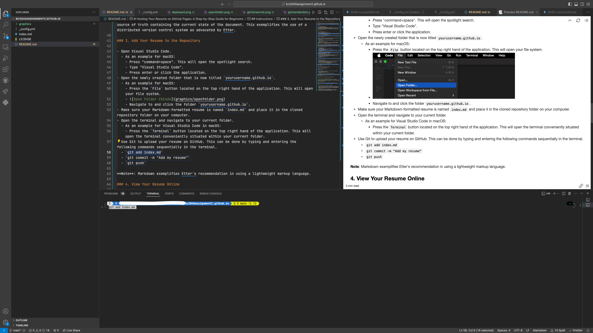
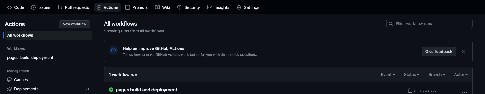

# Hosting Your Resume on GitHub Pages: A Step-by-Step Guide for Beginners

## Purpose

This guide shows the steps on how to host and format a Markdown resume on GitHub Pages, a static site hosting service that can utilize the static site generator Jekyll, while relating the process to the technical writing principles from Andrew Etter's book "Modern Technical Writing".

## Prerequisites

- A resume formatted in Markdown.
- A [GitHub](https://github.com) Account.
- Git installed in your chosen operating system. See the following [guide](https://git-scm.com/book/en/v2/Getting-Started-Installing-Git) on how to install Git.
- Visual Studio Code or a similar source-code editor installed in your chosen operating system. See the following [guide](https://code.visualstudio.com/docs/setup/setup-overview) on how to install Visual Studio Code.

## Instructions

### 1. Create a New Repository on GitHub

- Log into your GitHub account.
- Click the `New` button to create a new repository.  
  
- Name it `yourusername.github.io`, replacing `yourusername` with your actual GitHub username.
- Create the repository with a README file by clicking on the checkbox labeled `Add a README file` and then clicking `Create repository`.
  

**Note**: Utilizing GitHub exemplifies Etter's recommendation to share and host documents on a distributed version control system.

### 2. Clone Your Repository

- Click the `Code` button within your repository and then click on the two boxes layered over one another. This will copy the repository's link in your clipboard.
  
- Open your terminal.
  - As an example for macOS:
    - Press the `command⌘` and `space bar` keys at the same time. This will open Spotlight Search.
    - Type "terminal".
    - Press enter or click the application.
- Clone your repository to your computer by typing the `git clone` command followed by your repository's URL. This will create a new folder in your computer that mimics the GitHub repository.
  

**Note**: Cloning is a concept within Git that facilitates distributed version control. The concept allows a new edited version of the document to be created and later shared as the main source of truth containing the current state of the document. This exemplifies the use of a distributed version control system as advocated by Etter.

### 3. Add Your Resume to the Repository

- Open Visual Studio Code.
  - As an example for macOS:
    - Press "command+space". This will open the spotlight search.
    - Type "Visual Studio Code".
    - Press enter or click the application.
- Open the newly created folder that is now titled `yourusername.github.io`.
  - As an example for macOS:
    - Press the `File` button located on the top right hand of the application. This will open your file system.
    - 
    - Navigate to and click the folder `yourusername.github.io`.
- Make sure your Markdown-formatted resume is named `index.md` and place it in the cloned repository folder on your computer.
- Open the terminal and navigate to your current folder.
  - As an example for Visual Studio Code in macOS:
    - Press the `Terminal` button located on the top right hand of the application. This will open the terminal conveniently situated within your current folder.
    - 
- Use Git to upload your resume on GitHub. This can be done by typing and entering the following commands sequentially in the terminal.
  - `git add index.md`
  - `git commit -m "Add my resume"`
  - `git push`

**Note**: Markdown exemplifies Etter's recommendation in using a lightweight markup language.

### 4. View Your Resume Online

- Navigate to your github repository.
  - A simple way to do this is to open your preferred web browser and go to the link `https://github.com/yourusername/yourusername.github.io/`
- Click on the `Actions` tab to see if the resume has been generated and is online.
  - If the workflow shown below shows a green checkmark, the resume is now online.
  - 
  - Your resume is now live at `https://yourusername.github.io`.

**Note**: Implicitly deploying through GitHub Pages' built in site hosting by following all the previous steps exemplifies Etter's recommendation of using static site generator to present a document.

### 5. Format Your Resume

- Create a file inside the `yourusername.github.io` folder called `_config.yml`
- Copy and paste the following Jekyll formatting instructions inside the file:

```
remote_theme: pages-themes/minimal@v0.2.0
plugins:
  - jekyll-remote-theme
```

- Use Git to apply a minimal formatting to your resume, which can be seen at the same previous site `https://yourusername.github.io`. This can be done by typing and entering the following commands sequentially:
  - `git add _config.yml`
  - `git commit -m "Add formatting to my resume"`
  - `git push`

**Note**: Formatting the deployed resume through GitHub Pages' built in synergy with Jekyll by following the previous step exemplifies Etter's recommendation of formatting a document with a static site generator.

#### Example Resume Deployed Online


## More Resources

- [Markdown tutorial](https://www.markdowntutorial.com/)
- [Learn more about Jekyll and static site generators](https://jekyllrb.com/docs/)
- [Learn more about GitHub Pages and static site hosting services](https://docs.github.com/en/pages/getting-started-with-github-pages/about-github-pages)
- [Learn more about GitHub and distributed version control systems](https://docs.github.com/en/get-started/using-git/about-git)

## Authors and Acknowledgements

Credits to the [template contributors](https://github.com/pages-themes/minimal/graphs/contributors) and my team members Izan Cuetara Diez & NhatAnh Nguyen.

## FAQs

1. **Why is Markdown better than a word processor for resumes?**

   - Markdown is better than a word processor for resumes because of its simplicity and usability across various platforms. It allows users to focus on content through its strict and uniform formatting framework and usage. Since the format is enforced through symbols and syntax, it can be done through any text editor, making it lightweight unlike word processors.

2. **Why is my resume not showing up on GitHub Pages?**
   - Please see [this troubleshooting document](https://docs.github.com/en/pages/getting-started-with-github-pages/troubleshooting-404-errors-for-github-pages-sites) to figure out why your resume is not showing up on GitHub Pages.
